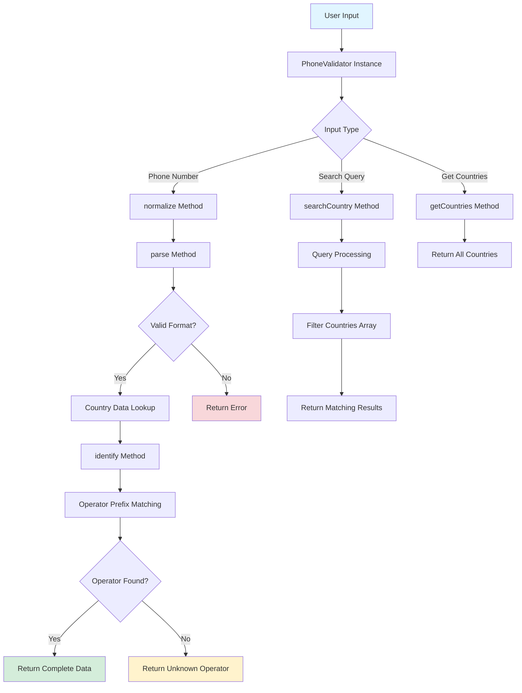
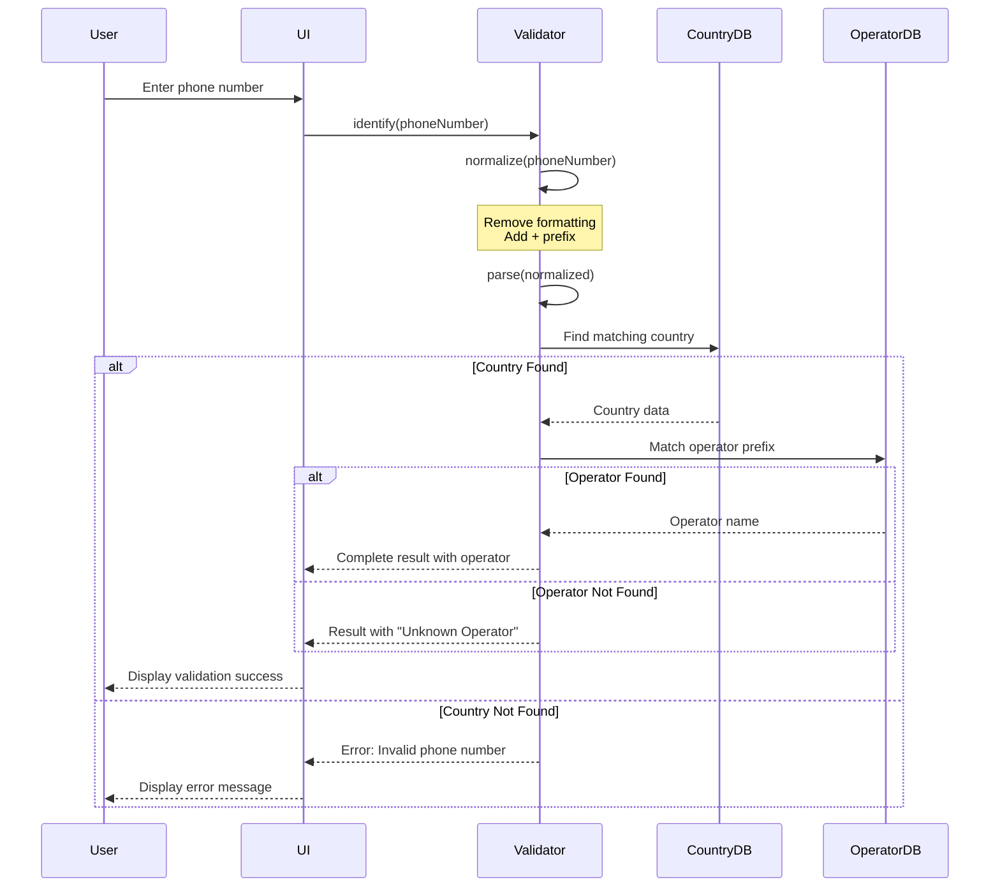
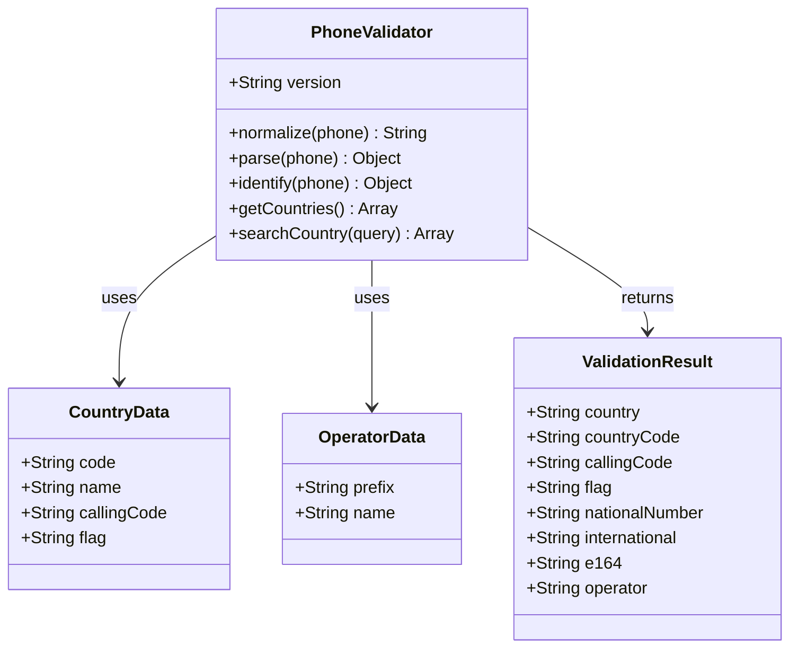

# 📱 xsukax Phone Validator

[](https://www.gnu.org/licenses/gpl-3.0)
[](https://developer.mozilla.org/en-US/docs/Web/JavaScript)
[](https://github.com/xsukax/xsukax-Phone-Validator)
[](https://github.com/xsukax/xsukax-Phone-Validator)

A lightweight, client-side phone number validation library with comprehensive support for 181 countries and operator detection for 50+ telecommunications providers worldwide. Built with pure JavaScript and designed for privacy-first validation without external API dependencies.

**🌐 Live Demo:** [https://xsukax.github.io/xsukax-Phone-Validator](https://xsukax.github.io/xsukax-Phone-Validator)

---

## 📋 Table of Contents

- [Project Overview](#-project-overview)
- [Security and Privacy Benefits](#-security-and-privacy-benefits)
- [Features and Advantages](#-features-and-advantages)
- [Installation Instructions](#-installation-instructions)
- [Usage Guide](#-usage-guide)
- [Architecture](#-architecture)
- [Configuration](#-configuration)
- [Contributing](#-contributing)
- [License](#-license)
- [Contact](#-contact)

---

## 🎯 Project Overview

xsukax Phone Validator is a comprehensive, client-side phone number validation solution designed for web applications requiring accurate international phone number processing. The library provides real-time validation, parsing, formatting, and operator identification across 181 countries with zero server-side dependencies.

### Core Capabilities

- **Phone Number Validation:** Parse and validate phone numbers in multiple formats (E.164, international, national)
- **Operator Identification:** Detect telecommunications operators for 50+ countries based on number prefixes
- **Country Recognition:** Identify countries from calling codes with visual flag representation
- **Format Conversion:** Convert between various phone number formats (E.164, international, national)
- **Country Search:** Search functionality for countries by name, ISO code, or calling code

### Technical Specifications

- **Zero Dependencies:** Pure JavaScript implementation with no external libraries required
- **Lightweight:** Core library under 30KB uncompressed
- **Browser Compatible:** Works in all modern browsers (Chrome, Firefox, Safari, Edge)
- **Module System Support:** Compatible with CommonJS, AMD, and browser globals
- **ES6+ Syntax:** Modern JavaScript with clean, maintainable code structure

---

## 🔒 Security and Privacy Benefits

xsukax Phone Validator is engineered with a privacy-first architecture that ensures complete data protection and security for end users:

### Client-Side Processing

All phone number validation and processing occurs entirely within the user's browser. No phone numbers, user inputs, or personal data are transmitted to external servers or third-party APIs. This architecture eliminates the risk of data interception, unauthorized access, or privacy breaches associated with server-side validation services.

### No External Dependencies

The library operates as a standalone module without requiring external API calls, third-party services, or remote data sources. This design principle ensures:

- **Data Sovereignty:** Users maintain complete control over their data
- **Zero Data Leakage:** No potential for information exposure through API communications
- **Offline Capability:** Full functionality without internet connectivity
- **No Third-Party Tracking:** Elimination of external analytics or tracking mechanisms

### No Data Storage or Transmission

The application follows a stateless processing model where:

- Phone numbers are processed in real-time without persistent storage
- No cookies, local storage, or session data are created
- No logging or telemetry data is collected
- Memory is cleared immediately after validation operations

### Compliance and Trust

This privacy-first approach ensures compliance with international data protection regulations including GDPR, CCPA, and similar frameworks. Users can trust that their sensitive phone number data remains confidential and is never exposed to potential security vulnerabilities inherent in cloud-based validation services.

### Transparent Source Code

As an open-source project licensed under GPL-3.0, all source code is publicly auditable. Security researchers and developers can verify the absence of backdoors, data collection mechanisms, or privacy-compromising implementations.

---

## ✨ Features and Advantages

### Comprehensive Global Coverage

- **181 Countries Supported:** Complete coverage of all major countries and territories worldwide
- **50+ Operator Databases:** Telecommunications provider identification across North America, Europe, Middle East, Asia, and Africa
- **Unicode Flag Support:** Visual country representation using emoji flags for enhanced user experience

### Advanced Parsing Capabilities

- **Multiple Format Support:** Handles various input formats including:
  - International format: `+1 555 123 4567`
  - E.164 format: `+15551234567`
  - National format: `(555) 123-4567`
  - Informal formats with spaces, dashes, dots, and parentheses
- **Automatic Normalization:** Intelligently cleans and standardizes phone number inputs
- **Flexible Prefix Handling:** Recognizes `+` prefix and `00` international dialing prefix

### Operator Detection Intelligence

- **Prefix-Based Identification:** Uses number prefix patterns to identify mobile operators
- **Major Carriers Covered:** Includes databases for leading global telecommunications providers:
  - **North America:** Verizon, AT&T, T-Mobile, Bell, Rogers, Telus
  - **Europe:** Vodafone, Orange, O2, EE, Three, Deutsche Telekom
  - **Middle East:** Zain, Ooredoo, Etisalat, STC, du
  - **Asia:** China Mobile, NTT DoCoMo, SK Telecom, Telkomsel
  - **Africa:** MTN, Vodacom, Airtel, Safaricom

### Developer-Friendly API

- **Simple Integration:** Clean, intuitive API with minimal configuration required
- **Comprehensive Documentation:** Detailed method descriptions and usage examples
- **Error Handling:** Graceful error management with informative error messages
- **TypeScript Ready:** Can be easily typed for TypeScript projects

### Performance Optimized

- **Fast Parsing:** Optimized algorithms for rapid phone number processing
- **Minimal Memory Footprint:** Efficient data structures for country and operator storage
- **No Network Latency:** Instant validation without API call delays

### User Interface Excellence

- **GitHub-Inspired Design:** Professional, clean interface following modern design principles
- **Responsive Layout:** Fully responsive design optimized for mobile, tablet, and desktop
- **Real-Time Validation:** Instant feedback as users input phone numbers
- **Search Functionality:** Intuitive country search with autocomplete-like experience

---

## 📦 Installation Instructions

### Method 1: Direct Download (Recommended for Quick Start)

1. Download the required files from the GitHub repository:
   ```bash
   git clone https://github.com/xsukax/xsukax-Phone-Validator.git
   cd xsukax-Phone-Validator
   ```

2. The repository contains three essential files:
   - `xPhoneValidator.js` - Core validation library
   - `index.html` - User interface and demo application
   - `README.md` - Documentation (this file)

3. No build process or dependencies installation required. The application is ready to use immediately.

### Method 2: CDN Integration (For Production Web Applications)

Include the validator script directly in your HTML:

```html
<!DOCTYPE html>
<html>
<head>
  <title>Phone Validation</title>
</head>
<body>
  <!-- Your HTML content -->
  
  <!-- Include the validator library -->
  <script src="https://cdn.jsdelivr.net/gh/xsukax/xsukax-Phone-Validator@main/xPhoneValidator.js"></script>
  
  <!-- Your application code -->
  <script>
    const validator = new PhoneValidator();
    // Start using the validator
  </script>
</body>
</html>
```

### Method 3: Local Integration

For projects with existing directory structures:

1. Copy `xPhoneValidator.js` to your project directory
2. Reference it in your HTML or import in your JavaScript modules:

```html
<!-- HTML Script Tag -->
<script src="path/to/xPhoneValidator.js"></script>
```

```javascript
// CommonJS (Node.js)
const PhoneValidator = require('./xPhoneValidator.js');

// ES6 Module (with bundler)
import PhoneValidator from './xPhoneValidator.js';
```

### Method 4: NPM Package (For Node.js Projects)

While not yet published to npm, you can install directly from GitHub:

```bash
npm install github:xsukax/xsukax-Phone-Validator
```

Then use in your Node.js application:

```javascript
const PhoneValidator = require('xsukax-phone-validator');
const validator = new PhoneValidator();
```

### Deployment Requirements

- **Web Server:** Any HTTP server (Apache, Nginx, Python SimpleHTTPServer, Node.js server)
- **Browser Requirements:** Modern browsers with ES6+ support (Chrome 60+, Firefox 55+, Safari 11+, Edge 79+)
- **No Server-Side Requirements:** PHP, Python, Ruby, or other server-side languages are NOT required
- **No Database:** All data is embedded in the JavaScript library

### Running the Demo Application

To run the included demo interface locally:

```bash
# Using Python 3
python -m http.server 8000

# Using Python 2
python -m SimpleHTTPServer 8000

# Using PHP
php -S localhost:8000

# Using Node.js (http-server)
npx http-server -p 8000
```

Then navigate to `http://localhost:8000` in your browser.

---

## 📖 Usage Guide

### Basic Implementation

#### Step 1: Initialize the Validator

```javascript
// Create a new PhoneValidator instance
const validator = new PhoneValidator();

// Check version
console.log(validator.version); // "2.0.0"
```

#### Step 2: Validate a Phone Number

```javascript
// Parse a phone number
const result = validator.parse('+1 555 123 4567');

console.log(result);
// Output:
// {
//   country: "United States",
//   countryCode: "US",
//   callingCode: "1",
//   flag: "🇺🇸",
//   nationalNumber: "5551234567",
//   international: "+1 5551234567",
//   e164: "+15551234567"
// }
```

#### Step 3: Identify Operator

```javascript
// Identify the telecommunications operator
const info = validator.identify('+44 7700 900123');

console.log(info);
// Output:
// {
//   country: "United Kingdom",
//   countryCode: "GB",
//   callingCode: "44",
//   flag: "🇬🇧",
//   nationalNumber: "7700900123",
//   international: "+44 7700900123",
//   e164: "+447700900123",
//   operator: "Vodafone UK"
// }
```

### Advanced Usage Examples

#### Example 1: Validating User Input in a Form

```javascript
function validatePhoneInput() {
  const phoneInput = document.getElementById('phoneNumber').value;
  const resultDiv = document.getElementById('result');
  
  // Validate the phone number
  const result = validator.identify(phoneInput);
  
  if (result.error) {
    resultDiv.innerHTML = `<p style="color: red;">❌ ${result.error}</p>`;
    return false;
  }
  
  resultDiv.innerHTML = `
    <div style="color: green;">
      <p>✅ Valid phone number</p>
      <p>${result.flag} ${result.country}</p>
      <p>Operator: ${result.operator}</p>
      <p>International: ${result.international}</p>
    </div>
  `;
  return true;
}

// Attach to form submission
document.getElementById('phoneForm').addEventListener('submit', function(e) {
  e.preventDefault();
  validatePhoneInput();
});
```

#### Example 2: Country Search Functionality

```javascript
// Search for countries by name, code, or calling code
function searchCountry(query) {
  const results = validator.searchCountry(query);
  
  results.forEach(country => {
    console.log(`${country.flag} ${country.name} (+${country.callingCode})`);
  });
  
  return results;
}

// Examples
searchCountry('united');    // Returns US, UK, UAE
searchCountry('GB');        // Returns United Kingdom
searchCountry('44');        // Returns countries with +44 code
```

#### Example 3: Get All Supported Countries

```javascript
// Retrieve complete list of supported countries
const countries = validator.getCountries();

console.log(`Total countries supported: ${countries.length}`);

// Display countries in a select dropdown
const select = document.getElementById('countrySelect');
countries.forEach(country => {
  const option = document.createElement('option');
  option.value = country.code;
  option.textContent = `${country.flag} ${country.name} (+${country.callingCode})`;
  select.appendChild(option);
});
```

#### Example 4: Format Phone Number for Display

```javascript
function formatPhoneForDisplay(phoneNumber) {
  const result = validator.parse(phoneNumber);
  
  if (!result) {
    return 'Invalid phone number';
  }
  
  // Return formatted international format
  return result.international;
}

// Usage
const formatted = formatPhoneForDisplay('+14155552671');
console.log(formatted); // "+1 4155552671"
```

#### Example 5: Validate Multiple Phone Numbers

```javascript
function validateBulkPhoneNumbers(phoneNumbers) {
  const results = [];
  
  phoneNumbers.forEach(phone => {
    const result = validator.identify(phone);
    results.push({
      input: phone,
      valid: !result.error,
      country: result.country || 'Unknown',
      operator: result.operator || 'Unknown'
    });
  });
  
  return results;
}

// Usage
const phoneList = [
  '+1 555 123 4567',
  '+44 7700 900123',
  '+91 98765 43210',
  'invalid-phone'
];

const validationResults = validateBulkPhoneNumbers(phoneList);
console.table(validationResults);
```

### Integration with Popular Frameworks

#### React Integration

```jsx
import React, { useState } from 'react';

function PhoneValidatorComponent() {
  const [phone, setPhone] = useState('');
  const [result, setResult] = useState(null);
  const validator = new PhoneValidator();
  
  const handleValidate = () => {
    const validationResult = validator.identify(phone);
    setResult(validationResult);
  };
  
  return (
    <div>
      <input 
        value={phone} 
        onChange={(e) => setPhone(e.target.value)}
        placeholder="Enter phone number"
      />
      <button onClick={handleValidate}>Validate</button>
      
      {result && !result.error && (
        <div>
          <p>{result.flag} {result.country}</p>
          <p>Operator: {result.operator}</p>
        </div>
      )}
    </div>
  );
}
```

#### Vue.js Integration

```vue
<template>
  <div>
    <input v-model="phone" placeholder="Enter phone number" />
    <button @click="validatePhone">Validate</button>
    
    <div v-if="result && !result.error">
      <p>{{ result.flag }} {{ result.country }}</p>
      <p>Operator: {{ result.operator }}</p>
    </div>
  </div>
</template>

<script>
export default {
  data() {
    return {
      phone: '',
      result: null,
      validator: new PhoneValidator()
    };
  },
  methods: {
    validatePhone() {
      this.result = this.validator.identify(this.phone);
    }
  }
};
</script>
```

### API Reference

#### Constructor

```javascript
new PhoneValidator()
```

Creates a new instance of the PhoneValidator class.

#### Methods

##### `normalize(phone)`

Normalizes a phone number to E.164 format.

- **Parameters:** `phone` (string) - Phone number in any format
- **Returns:** (string) - Normalized phone number with `+` prefix
- **Example:** `normalize('(555) 123-4567')` → `'+5551234567'`

##### `parse(phone)`

Parses a phone number and extracts country information.

- **Parameters:** `phone` (string) - Phone number to parse
- **Returns:** (object|null) - Parsed phone information or null if invalid
- **Example:**
  ```javascript
  {
    country: "United States",
    countryCode: "US",
    callingCode: "1",
    flag: "🇺🇸",
    nationalNumber: "5551234567",
    international: "+1 5551234567",
    e164: "+15551234567"
  }
  ```

##### `identify(phone)`

Identifies the telecommunications operator for a given phone number.

- **Parameters:** `phone` (string) - Phone number to identify
- **Returns:** (object) - Complete phone information with operator
- **Example:**
  ```javascript
  {
    ...parseResult,
    operator: "Verizon"
  }
  ```

##### `getCountries()`

Returns an array of all supported countries.

- **Returns:** (array) - Array of country objects
- **Example:**
  ```javascript
  [
    { code: "US", name: "United States", callingCode: "1", flag: "🇺🇸" },
    { code: "GB", name: "United Kingdom", callingCode: "44", flag: "🇬🇧" }
    // ... 179 more countries
  ]
  ```

##### `searchCountry(query)`

Searches for countries by name, ISO code, or calling code.

- **Parameters:** `query` (string) - Search query (case-insensitive)
- **Returns:** (array) - Array of matching country objects
- **Example:** `searchCountry('united')` → Returns US, UK, UAE

---

## 🏗️ Architecture

### System Architecture Overview



### Phone Number Validation Flow



### Data Structure Architecture



### Component Architecture

The application follows a modular architecture with clear separation of concerns:

1. **Core Library (`xPhoneValidator.js`)**
   - Country data storage (181 countries)
   - Operator databases (50+ countries)
   - Validation algorithms
   - Parsing and formatting logic

2. **User Interface (`index.html`)**
   - Input validation interface
   - Country search functionality
   - Results display
   - Statistics dashboard

3. **Data Layer**
   - Static country database (no external calls)
   - Operator prefix patterns
   - ISO country codes with Unicode flags

---

## ⚙️ Configuration

### PHP Configuration (Not Required)

**Note:** This application does not require PHP or any server-side configuration. The note about `php.ini` is not applicable as xsukax Phone Validator is a pure client-side JavaScript application that runs entirely in the browser without server-side processing.

However, if you choose to deploy this application on a PHP-enabled server (though unnecessary), no special PHP configuration is needed. The application will function identically with or without PHP.

### Browser Configuration

For optimal performance, ensure the following browser settings:

- **JavaScript:** Must be enabled
- **Cookies:** Not required (application does not use cookies)
- **Local Storage:** Not used (no persistent data storage)
- **Third-Party Scripts:** Not required (no external dependencies)

### Customization Options

#### Modifying Country Database

To add or modify country data, edit the `COUNTRIES` object in `xPhoneValidator.js`:

```javascript
const COUNTRIES = {
  'XX': { name: 'Custom Country', code: '999', flag: '🏴' },
  // ... existing countries
};
```

#### Adding Operator Databases

To add operator detection for additional countries, extend the `OPERATORS` object:

```javascript
const OPERATORS = {
  'XX': [
    { prefix: '5|6|7', name: 'Custom Operator / Alternative Operator' }
  ],
  // ... existing operators
};
```

#### Customizing UI Appearance

The application uses inline CSS in `index.html`. To customize the appearance:

1. Locate the `<style>` section in `index.html`
2. Modify CSS variables and classes
3. Key customizable elements:
   - Color scheme (currently GitHub-inspired)
   - Font families
   - Layout dimensions
   - Border styles and shadows

Example customization:

```css
/* Change primary color scheme */
.btn {
  background-color: #0066cc; /* Change button color */
}

.result-success {
  background: #e6f7ff; /* Change success background */
}
```

---

## 🤝 Contributing

Contributions to xsukax Phone Validator are welcome and appreciated! Whether you're fixing bugs, adding new operator databases, expanding country coverage, or improving documentation, your input helps make this tool better for everyone.

### How to Contribute

1. **Fork the Repository**
   ```bash
   git clone https://github.com/xsukax/xsukax-Phone-Validator.git
   cd xsukax-Phone-Validator
   ```

2. **Create a Feature Branch**
   ```bash
   git checkout -b feature/your-feature-name
   ```

3. **Make Your Changes**
   - Add new operator databases
   - Improve validation algorithms
   - Enhance documentation
   - Fix bugs or issues

4. **Test Your Changes**
   - Ensure all existing functionality still works
   - Test new features thoroughly
   - Validate phone numbers from affected countries

5. **Commit Your Changes**
   ```bash
   git add .
   git commit -m "Add: Description of your changes"
   ```

6. **Push to GitHub**
   ```bash
   git push origin feature/your-feature-name
   ```

7. **Create a Pull Request**
   - Go to the GitHub repository
   - Click "New Pull Request"
   - Provide a clear description of your changes

### Contribution Guidelines

- Follow existing code style and conventions
- Include comments for complex logic
- Update documentation for new features
- Test thoroughly before submitting
- Be respectful and constructive in discussions

### Priority Contribution Areas

- **Operator Databases:** Adding operator detection for countries without databases
- **Number Format Validation:** Improving validation rules for specific countries
- **Documentation:** Translating documentation to other languages
- **Bug Fixes:** Addressing reported issues
- **Performance:** Optimizing parsing and validation algorithms

---

## 📄 License

This project is licensed under the GNU General Public License v3.0.

---

## 📞 Contact

**Developer:** xsukax

**GitHub:** [https://github.com/xsukax](https://github.com/xsukax)

**Repository:** [https://github.com/xsukax/xsukax-Phone-Validator](https://github.com/xsukax/xsukax-Phone-Validator)

**Issues:** [https://github.com/xsukax/xsukax-Phone-Validator/issues](https://github.com/xsukax/xsukax-Phone-Validator/issues)

---

## 🙏 Acknowledgments

- Country flag emojis from Unicode Standard
- Telecommunications operator data compiled from public sources
- ISO 3166-1 alpha-2 country codes
- E.164 international phone number standard

---

## 📊 Project Statistics

- **Total Countries:** 181
- **Operator Databases:** 50+
- **Code Size:** ~30KB (uncompressed)
- **Dependencies:** Zero
- **Browser Support:** All modern browsers
- **License:** GPL-3.0

---

**⭐ If you find this project useful, please consider giving it a star on GitHub!**
